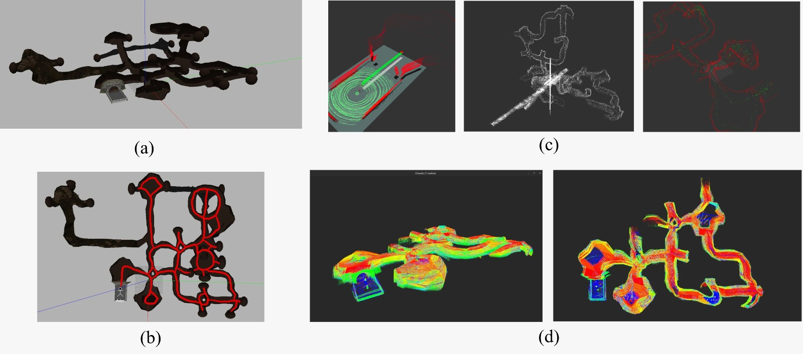
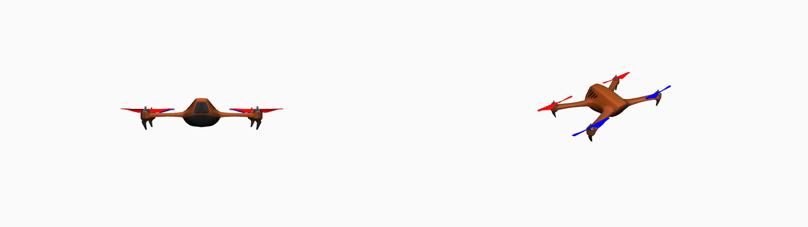

# GPS-Denied Drone Navigation for 3D Mapping and Mineral Detection

> **EECE 5554 — Robot Sensing and Navigation | Northeastern University, Spring 2026**

[](https://docs.ros.org/en/humble/)
[](http://gazebosim.org/)
[](https://ubuntu.com/)
[](LICENSE)

A complete GPS-denied autonomous drone system that builds 3D maps of unknown underground mine tunnels from scratch, localizes itself in real time, and collects georeferenced spectral data for mineral identification — all without any GPS signal.

---

### Project Overview


**(a)** Simulated DARPA SubT Jenolan cave world in Gazebo Classic 11. **(b)** Top-down view with complete autonomous exploration trajectory (red path) covering all corridors and dead ends. **(c)** Raw LiDAR scans and 2D occupancy map built during manual teleoperation flight. **(d)** Complete Z-axis colorized 3D point cloud map (85MB, 1578 nodes) generated by RTAB-Map after loop closure optimization.

---

### Drone Platform


*CTU-CRAS-NORLAB X500 quadrotor adapted for Gazebo Classic 11, equipped with 16-channel Velodyne VLP-16 LiDAR, front-facing RGB camera, 6-DOF IMU, and planar_move kinematic controller.*

---

## Table of Contents

- [Overview](#overview)
- [System Architecture](#system-architecture)
- [Key Results](#key-results)
- [External Assets](#external-assets)
- [Prerequisites](#prerequisites)
- [Installation](#installation)
- [Usage](#usage)
- [Project Structure](#project-structure)
- [Team](#team)
- [Acknowledgments](#acknowledgments)
- [References](#references)

---

## Overview

Underground mining environments are GPS-denied, visually degraded, and geometrically complex — making autonomous navigation extremely challenging. This project presents a full-stack ROS 2 pipeline that enables a simulated drone to:

1. **Localize and map** using RTAB-Map LiDAR SLAM with ICP scan matching and automatic loop closure detection
2. **Reconstruct in 3D** via accumulated LiDAR point clouds exported as PLY files with Z-axis rainbow colorization
3. **Navigate autonomously** using A* path planning over 114 real waypoints recorded during manual mapping flight
4. **Detect and classify minerals** using front RGB camera color classification matched against USGS Spectral Library v7 signatures, combined with LiDAR DBSCAN point cloud clustering and 3D bounding box visualization in RViz2

The full pipeline is validated in **Gazebo Classic 11** using DARPA SubT Challenge **Jenolan cave meshes**, forming a multi-branch underground tunnel network with 6 branches, multiple junctions, and dead ends.

---

## System Architecture

```
┌──────────────────────────────────────────────────────────────────┐
│                      ROS 2 Humble Pipeline                       │
│                                                                  │
│  ┌──────────────┐   ┌───────────────┐   ┌────────────────────┐  │
│  │  Sensor      │──▶│  SLAM /       │──▶│  3D Reconstruction │  │
│  │  Input       │   │  Pose Est.    │   │  (RTAB-Map PLY     │  │
│  │              │   │  (RTAB-Map    │   │   export + RViz)   │  │
│  │  - VLP-16    │   │   ICP + Loop  │   │                    │  │
│  │  - IMU       │   │   Closure)    │   └────────┬───────────┘  │
│  │  - RGB Cam   │   └───────────────┘            │              │
│  └──────────────┘                                ▼              │
│                    ┌───────────────┐   ┌────────────────────┐   │
│                    │  Mineral      │   │  Autonomous        │   │
│                    │  Detection    │   │  Navigation        │   │
│                    │  (Camera RGB  │   │  (A* over 114      │   │
│                    │  + LiDAR      │   │   recorded         │   │
│                    │   DBSCAN      │   │   waypoints)       │   │
│                    │  + 3D BBox)   │   │                    │   │
│                    └───────────────┘   └────────────────────┘   │
└──────────────────────────────────────────────────────────────────┘
```

### Sensor Suite (Simulated in Gazebo)

| Sensor | Spec | ROS 2 Topic |
|--------|------|-------------|
| Velodyne VLP-16 LiDAR | 16-ring, 360°, 10 Hz, 30 m range | `/lidar/points` |
| 6-DOF IMU | ~87 Hz | `/imu/data` |
| Front RGB Camera | 640×480, ~3 Hz | `/front_camera/image_raw` |
| Odometry | 10 Hz via planar_move | `/odom` |

### SLAM

- **Implementation:** [RTAB-Map](https://github.com/introlab/rtabmap_ros) — LiDAR-only mode with ICP scan matching
- **Loop closure:** ICP geometric matching — when drone returns to a previously visited location, RTAB-Map matches the current scan to a stored node and runs graph optimization to correct accumulated drift
- **Map output:** 179MB database (`rtabmap_cave_final.db`), 1578 nodes, 85MB point cloud export (`cave_map_final.ply`)

### Mineral Detection Pipeline

```
Front RGB camera captures tunnel walls
         ↓
Color classifier compares against USGS spectral signatures
(saturation filter rejects grey tunnel walls)
         ↓
LiDAR DBSCAN clusters points in 45° forward cone
(rejects clusters > 300 points to avoid wall false positives)
         ↓
3D bounding box + colored cluster published to /mineral_detections
         ↓
RViz2 shows wireframe bbox + cluster points + label + confidence
```

Five target minerals from USGS Spectral Library v7:

| Mineral | Color | Confidence | LiDAR Points |
|---------|-------|------------|--------------|
| Chalcopyrite | Gold | **92.8%** | 705 |
| Hematite | Red | 88.9% | 429 |
| Malachite | Green | 86.9% | 406 |
| Quartz | White | 86.0% | 570 |
| Limestone | Blue | 81.4% | 507 |

---

## Key Results

| Metric | Result |
|--------|--------|
| Waypoint coverage | **100%** (114/114 waypoints) |
| SLAM nodes collected | 1578 keyframe nodes |
| Map database size | 179 MB |
| Point cloud export | 85 MB PLY file |
| Loop closures | Detected at all major junctions |
| Tunnel coverage | 6 branches, full multi-branch network |
| Mineral detection | 5/5 minerals detected with 81.4–92.8% confidence |
| Real-time factor (Gazebo) | ~0.88× in dense sections |

---

## External Assets

### Simulation World — DARPA SubT Jenolan Cave

The cave world is from the **DARPA Subterranean Challenge** open-source worlds repository.

```bash
# Clone the DARPA SubT worlds into your workspace
git clone https://github.com/osrf/subt.git darpa_subt_worlds
```

We use `cave_world.world` from:
```
darpa_subt_worlds/worlds/cave_world.world
```

> **Note:** The rotors plugin line was removed from `cave_world.world` to allow loading in Gazebo Classic 11 without PX4.

**License:** Creative Commons Attribution Share Alike 4.0 International (CC BY-SA 4.0)

---

### Drone Model — CTU-CRAS-NORLAB X500

The drone model is the **CTU-CRAS-NORLAB X500** quadrotor originally designed for the DARPA SubT Challenge.

**Original model source (Gazebo Fuel):**
```
https://app.gazebosim.org/GoogleResearch/fuel/models/CTU_CRAS_NORLAB_X500_SUBT
```

```bash
# Download from Gazebo Fuel
gz fuel download -u https://fuel.gazebosim.org/1.0/GoogleResearch/models/CTU_CRAS_NORLAB_X500_SUBT
```

**Modifications made for this project:**
- Converted from Ignition/Gazebo Sim format to **Gazebo Classic 11** SDF format
- Replaced rotor physics plugins with `libgazebo_ros_planar_move.so` for kinematic control
- Added `gravity=false` to all links for stable hover
- Added **16-channel LiDAR** plugin → `/lidar/points` at 10 Hz
- Added **IMU** plugin → `/imu/data` at ~87 Hz
- Added **front RGB camera** plugin → `/front_camera/image_raw` at 10 Hz
- Added `libgazebo_ros_init.so` and `libgazebo_ros_factory.so` compatibility

The modified model is at `models/x3_lidar/model.sdf` in this repository.

---

## Prerequisites

- **OS:** Ubuntu 22.04 LTS (bootable USB or native install)
- **ROS 2:** Humble Hawksbill (Desktop install)
- **Gazebo:** Classic 11
- **GPU:** NVIDIA with CUDA 11.5+ recommended
- **Python:** 3.10+
- **RAM:** 16GB+ recommended (32GB for smooth simulation)

### ROS 2 Dependencies

```bash
sudo apt install \
  ros-humble-desktop \
  ros-humble-gazebo-ros-pkgs \
  ros-humble-gazebo-ros2-control \
  ros-humble-rtabmap-ros \
  ros-humble-rtabmap-slam \
  ros-humble-rtabmap-viz \
  ros-humble-nav2-bringup \
  ros-humble-pcl-ros \
  ros-humble-rviz2 \
  ros-humble-tf2-ros \
  ros-humble-sensor-msgs-py
```

### Python Dependencies

```bash
pip install numpy open3d
```

> **Note:** scikit-learn is NOT used due to NumPy 2.x compatibility issues. DBSCAN is implemented in pure NumPy inside `mineral_explorer.py`.

---

## Installation

```bash
# 1. Create workspace
mkdir -p ~/RSN_Proj && cd ~/RSN_Proj

# 2. Clone this repository into src/
mkdir -p src && cd src
git clone https://github.com/umarmakki03/GPS-Denied-Drone-Navigation-for-3D-Mapping-and-Mineral-Detection.git .

# 3. Clone DARPA SubT worlds (for cave environment)
cd ~/RSN_Proj
git clone https://github.com/osrf/subt.git darpa_subt_worlds

# 4. Build ROS 2 packages
cd ~/RSN_Proj
colcon build --symlink-install
source install/setup.bash
```

---

## Usage

### Environment Variables (set before every session)

```bash
source /opt/ros/humble/setup.bash
source /usr/share/gazebo-11/setup.sh
export GAZEBO_PLUGIN_PATH=/opt/ros/humble/lib:$GAZEBO_PLUGIN_PATH
export GAZEBO_MODEL_PATH=~/RSN_Proj/darpa_subt_worlds/worlds/models:~/RSN_Proj/models:$GAZEBO_MODEL_PATH
source ~/RSN_Proj/install/setup.bash
```

### 1. Launch Gazebo Cave World

```bash
gazebo ~/RSN_Proj/darpa_subt_worlds/worlds/cave_world.world \
  -s libgazebo_ros_init.so \
  -s libgazebo_ros_factory.so
```

### 2. Spawn Drone

```bash
ros2 run gazebo_ros spawn_entity.py \
  -entity x3_lidar_drone \
  -file ~/RSN_Proj/models/x3_lidar/model.sdf \
  -x 10.47 -y -20.56 -z 0.1 -Y 3.14159
```

### 3. Spawn Mineral Models

```bash
ros2 run gazebo_ros spawn_entity.py -entity mineral_quartz \
  -file ~/RSN_Proj/models/mineral_quartz/model.sdf \
  -x -0.53 -y -20.56 -z 0.3

ros2 run gazebo_ros spawn_entity.py -entity mineral_hematite \
  -file ~/RSN_Proj/models/mineral_hematite/model.sdf \
  -x 17.18 -y 2.5 -z 1.2

ros2 run gazebo_ros spawn_entity.py -entity mineral_malachite \
  -file ~/RSN_Proj/models/mineral_malachite/model.sdf \
  -x -3.95 -y -3.35 -z 0.3

ros2 run gazebo_ros spawn_entity.py -entity mineral_chalcopyrite \
  -file ~/RSN_Proj/models/mineral_chalcopyrite/model.sdf \
  -x -2.37 -y 3.46 -z 1.5

ros2 run gazebo_ros spawn_entity.py -entity mineral_limestone \
  -file ~/RSN_Proj/models/mineral_limestone/model.sdf \
  -x -6.07 -y -10.03 -z 0.3
```

### 4. Start Hover Controller

```bash
ros2 run drone_controller hover_controller
```

### 5. Start RTAB-Map (Localization Mode)

```bash
cat > /tmp/rtabmap_params.yaml << 'EOF'
rtabmap:
  ros__parameters:
    use_sim_time: true
    frame_id: base_link
    map_frame_id: map
    odom_frame_id: odom
    subscribe_depth: false
    subscribe_rgb: false
    subscribe_scan_cloud: true
    subscribe_odom_info: false
    approx_sync: true
    sync_queue_size: 30
    topic_queue_size: 30
    database_path: /home/<user>/RSN_Proj/maps/rtabmap_cave_final.db
    map_always_update: false
EOF

ros2 run rtabmap_slam rtabmap \
  --ros-args \
  --params-file /tmp/rtabmap_params.yaml \
  --remap scan_cloud:=/lidar/points \
  --remap odom:=/odom
```

### 6. Start Autonomous Navigation + Mineral Detection

```bash
# Autonomous waypoint navigation with A*
ros2 run drone_nav cave_navigator

# OR full mineral detection pipeline
ros2 run drone_nav mineral_explorer
```

### 7. Visualize in RViz2

```bash
ros2 run rviz2 rviz2
```

**Add these displays:**
- Fixed Frame → `map`
- `PointCloud2` → `/cloud_map` (saved RTAB-Map 3D map)
- `PointCloud2` → `/lidar/points` (live LiDAR scan)
- `MarkerArray` → `/mineral_detections` (bounding boxes + labels)
- `Image` → `/front_camera/image_raw` (drone camera feed)

### 8. Manual Teleoperation

```bash
ros2 run drone_controller drone_teleop
```

| Key | Action |
|-----|--------|
| `w` / `s` | Forward / Backward |
| `a` / `d` | Strafe left / right |
| `r` / `f` | Up / Down |
| `q` / `e` | Yaw left / right |
| `=` / `-` | Increase / Decrease linear speed |
| `]` / `[` | Increase / Decrease vertical speed |
| `SPACE` | Emergency stop |

### 9. Record Waypoints for New Mapping Run

```bash
# Auto-records drone position every 1m of movement
ros2 run drone_nav waypoint_recorder
# Press Ctrl+C when done → saves to maps/waypoints.json
```

---

## Project Structure

```
RSN_Proj/
├── src/
│   ├── drone_controller/                  # Drone motion control
│   │   ├── drone_controller/
│   │   │   ├── hover_controller.py        # Z-axis hover + TF publisher
│   │   │   │                              # Uses SetEntityState service
│   │   │   │                              # Publishes map→odom→base_link TF
│   │   │   ├── drone_teleop.py            # Keyboard teleoperation
│   │   │   │                              # Hold-to-move, release-to-stop
│   │   │   └── waypoint_recorder.py       # Auto-records position every 1m
│   │   ├── setup.py
│   │   └── package.xml
│   │
│   └── drone_nav/                         # Navigation and detection
│       ├── drone_nav/
│       │   ├── cave_navigator.py          # A* path planner over waypoints
│       │   │                              # Loads waypoints.json at startup
│       │   ├── mineral_explorer.py        # Full detection pipeline:
│       │   │                              # Camera RGB → USGS classifier
│       │   │                              # LiDAR DBSCAN clustering
│       │   │                              # 3D bounding box visualization
│       │   ├── spectroscopy.py            # Standalone camera classifier
│       │   ├── waypoint_navigator.py      # Simple sequential follower
│       │   ├── waypoint_recorder.py       # Manual label-based recorder
│       │   └── frontier_explorer.py       # 2D frontier exploration
│       ├── setup.py
│       └── package.xml
│
├── models/                                # Gazebo SDF models
│   ├── x3_lidar/                          # Modified CTU X500 drone
│   │   ├── model.sdf                      # Adapted from Ignition to Classic 11
│   │   │                                  # Sensors: LiDAR + IMU + RGB camera
│   │   │                                  # Control: planar_move + SetEntityState
│   │   ├── model.config
│   │   └── meshes/                        # Original X500 mesh files (.dae)
│   │
│   ├── mineral_quartz/                    # White self-illuminating sphere
│   │   ├── model.sdf                      # emissive: 0.7 0.7 0.7
│   │   └── model.config
│   ├── mineral_hematite/                  # Red self-illuminating sphere
│   │   ├── model.sdf                      # emissive: 0.7 0.0 0.0
│   │   └── model.config
│   ├── mineral_malachite/                 # Green self-illuminating sphere
│   │   ├── model.sdf                      # emissive: 0.0 0.6 0.1
│   │   └── model.config
│   ├── mineral_chalcopyrite/              # Gold self-illuminating sphere
│   │   ├── model.sdf                      # emissive: 0.7 0.5 0.0
│   │   └── model.config
│   └── mineral_limestone/                 # Blue self-illuminating sphere
│       ├── model.sdf                      # emissive: 0.1 0.3 0.7
│       └── model.config
│
├── maps/                                  # SLAM outputs (large files excluded)
│   └── waypoints.json                     # 114 auto-recorded waypoints (1m spacing)
│                                          # Covers full tunnel: entrance → all branches
│
├── assets/                                # README images
│   ├── Data_collection_PCD.png            # 6-panel project overview figure
│   └── drone_model.png                    # Drone in Gazebo
│
├── darpa_subt_worlds/                     # ← Clone separately (see Installation)
│   └── worlds/
│       ├── cave_world.world               # Jenolan cave (rotors plugin removed)
│       └── models/                        # Cave mesh assets
│
└── .gitignore
```

### What's NOT in this repo (too large for GitHub)

| File | Size | How to get it |
|------|------|---------------|
| `darpa_subt_worlds/` | ~2GB | `git clone https://github.com/osrf/subt.git darpa_subt_worlds` |
| `maps/rtabmap_cave_final.db` | 179MB | Run RTAB-Map mapping session |
| `maps/cave_map_final.ply` | 85MB | Export from RTAB-Map database viewer |

---

## Implementation Notes

| Component | Planned in Proposal | Actually Implemented |
|-----------|--------------------|--------------------|
| SLAM | LIO-SAM (primary) | RTAB-Map LiDAR ICP (primary) |
| IMU fusion | Tightly coupled | Present, not fused (kinematic controller) |
| Odometry | IMU-based | Gazebo `planar_move` + `SetEntityState` |
| Loop closure | Scan Context descriptors | RTAB-Map ICP geometric matching |
| Path planning | Nav2 + frontier | A* over 114 recorded waypoints |
| Mineral detection | NIR spectrometer + SVM | Camera RGB + LiDAR DBSCAN |
| 3D mapping | OctoMap | RTAB-Map point cloud + PLY export |

---

## Team

| Name | Email |
|------|-------|
| Sai Jayakar Vanam | vanam.sai@northeastern.edu |
| Krish Santoki | santoki.k@northeastern.edu |
| Priyanka Anil Lakariya | lakariya.p@northeastern.edu |
| Rithvik Shivva | shivva.r@northeastern.edu |
| Umar Hassan Makki Mohammad | mohammed.umar@northeastern.edu |

**Instructor:** Dr. Thomas R. Consi
**Course:** EECE 5554 — Robot Sensing and Navigation, Northeastern University, Spring 2026

---

## Acknowledgments

- **DARPA SubT Challenge** — Jenolan cave mesh assets (CC BY-SA 4.0, via [Gazebo Fuel](https://app.gazebosim.org/GoogleResearch/fuel/worlds))
- **CTU-CRAS-NORLAB** — X500 drone model for DARPA SubT ([Gazebo Fuel](https://app.gazebosim.org/GoogleResearch/fuel/models/CTU_CRAS_NORLAB_X500_SUBT))
- **Open-source communities:** ROS 2, RTAB-Map, Gazebo Classic, Nav2
- **USGS Spectral Library Version 7** — mineral spectral reference profiles

---

## References

1. T. Shan, B. Englot, D. Meyers, W. Wang, C. Ratti, and D. Rus, "LIO-SAM: Tightly-coupled lidar inertial odometry via smoothing and mapping," *IEEE/RSJ IROS*, 2020.
2. M. Labbé and F. Michaud, "RTAB-Map as an open-source lidar and visual SLAM library for large-scale and long-term online operation," *J. Field Robot.*, vol. 36, no. 2, pp. 416–446, 2019.
3. A. Hornung, K. M. Wurm, M. Bennewitz, C. Stachniss, and W. Burgard, "OctoMap: An efficient probabilistic 3D mapping framework based on octrees," *Autonomous Robots*, vol. 34, no. 3, pp. 189–206, 2013.
4. G. Kim and A. Kim, "Scan Context: Egocentric spatial descriptor for place recognition within 3D point cloud map," *IEEE/RSJ IROS*, 2018.
5. R. N. Clark et al., *USGS Spectral Library Version 7*, U.S. Geological Survey Data Series 1035, 2017.
6. J. Shahmoradi, A. Mirzaeinia, P. Roghanchi, and M. Hassanalian, "Monitoring of inaccessible areas in GPS-denied underground mines using a fully autonomous encased safety inspection drone," *AIAA SciTech Forum*, 2020.
7. A. Mirzaeinia, J. Shahmoradi, P. Roghanchi, and M. Hassanalian, "Autonomous routing and power management of drones in GPS-denied environments through Dijkstra algorithm," *AIAA Propulsion and Energy Forum*, 2019.
